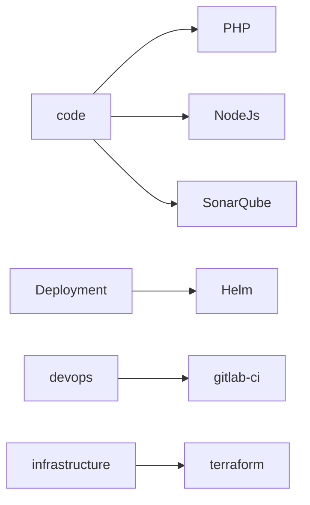

# gitlab-ci-templates


[](https://git.maisonsdumonde.net/common/gitlab-ci-templates/-/releases)

## Introduction

This repository contain all jobs you need to work with pipelines in Maisons Du Monde.
When you want to use a job you can include them to your repository.

Exemple for all jobs for build and test php :

```yaml
---
include:
   - project: common/gitlab-ci-templates
     ref: <tag or branch name>
     file:
        - /code/php/build.yaml
        - /code/php/test.yaml
```

you can use templated with keyword `extends :`

exemple :

```yaml
---
build:code:
    stage: build
    extends: .template:php_build
```

## Templates catalog

This is the templates tree architecture :


each folders contain Readme

## GitFlow

create branche feature/<ticket number>, merge on master, after validation create tag
